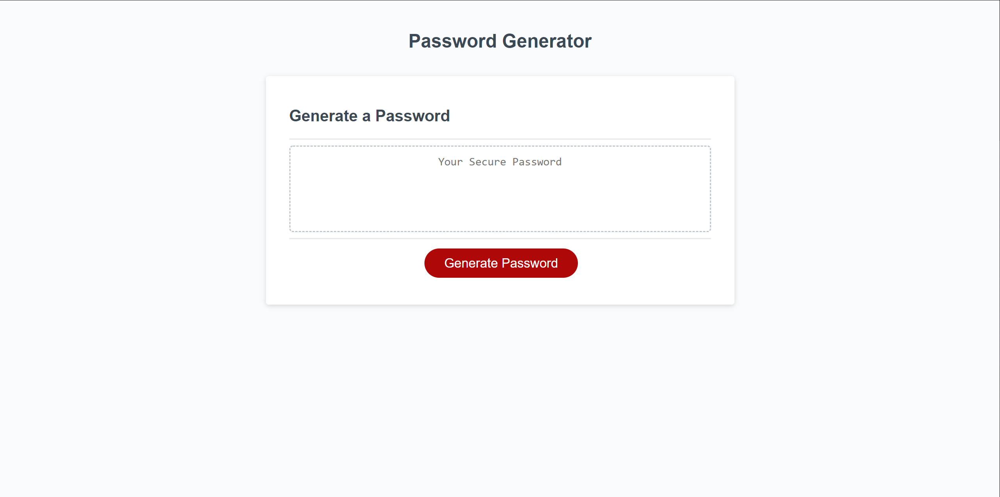
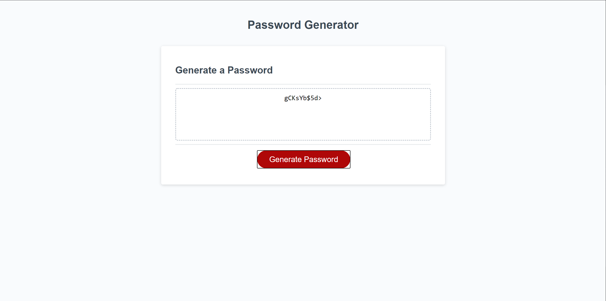

# Password-Generator

## Description

This password generator presents the user with a series of prompts asking for password criteria. The user explains the desired length of the password, along with whether or not they want numbers, special characters, upper case letters, and/or lower case letters included. (Note: the user must chose a length between 8 and 128 characters and must pick at least one of the available criteria in order for the application to work.) The application will then use the user input to generate a random password that meets all desired criteria. The password will be displayed in the provided text box.

## Screenshots

## Links

https://github.com/ccardinale98/Password-Generator

https://ccardinale98.github.io/Password-Generator/